# ai-sales-intelligence-system
AI-powered lead enrichment, industry matching, personalized outreach & lead scoring using n8n, OpenAI and Google Sheets.

# 🚀 AI Sales Intelligence System (Lead → Mail Draft → Score → CRM)

An AI-powered sales automation workflow built using **n8n**, **OpenAI**, and **Google Sheets**.

This demo shows how inbound leads (e.g., from a website form) can be automatically analyzed, enriched, matched to the best-fitting case study, turned into a personalized email draft, scored, and finally written into a CRM-like sheet.

---

# 🧠 Overview

The system simulates a production-ready **B2B inbound lead pipeline**:

1) Lead comes in via webhook  
2) LLM extracts structured fields (industry, urgency, pains, etc.)  
3) Data cleaning + normalization  
4) Pull case studies from a sheet  
5) Match lead to industry/case study  
6) Generate a personalized mail draft  
7) Compute lead score  
8) Merge everything into one record  
9) Final scoring + status  
10) Append into Google Sheets “CRM”  
11) Execution proof in n8n

---

# 🏗 System Architecture

High-level overview of the complete n8n pipeline (end-to-end):

---

# 🔌 API / Webhook

Example API payload for inbound leads (e.g., website form submission):

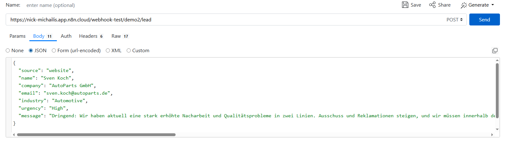

---

# ⚙️ Live Workflow (Step-by-Step)

## 01) Lead In (Webhook Ingestion)

Incoming lead is received via HTTP POST webhook (source, name, company, email, industry, urgency, message).

---

## 02) AI Analyse (LLM → Structured Fields)

OpenAI analyzes the incoming lead message and returns strictly structured JSON fields such as:

- industry
- role
- budget_range
- urgency
- key_pains
- recommended_offer
- lead_score (initial)

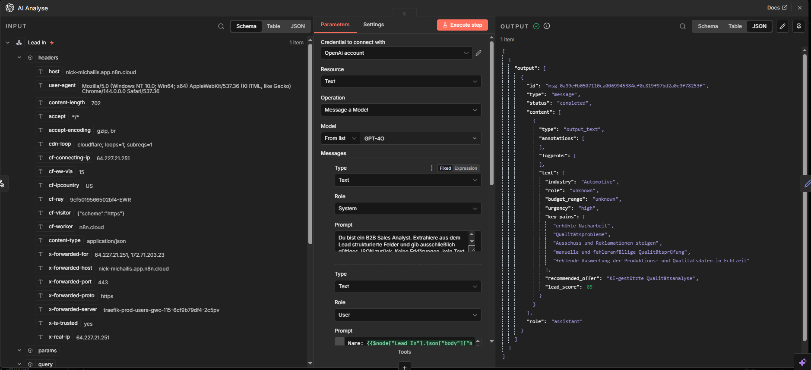

---

## 03) Data Cleaning (Normalization)

Cleans and normalizes extracted fields (e.g., mapping/standardizing the industry into a consistent format for matching).

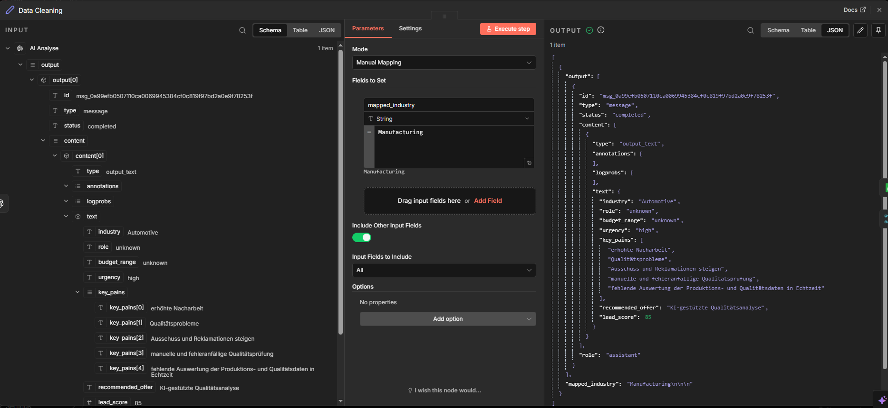

---

## 04) Case Study Data (Fetch Reference Proof)

Reads relevant case studies from Google Sheets (industry → problem → solution → results metrics → one-liner).

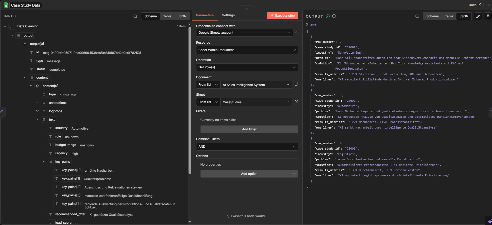

---

## 05) Industry Matching (Select Best Fit)

Filters the case study dataset to keep only the case study that matches the lead’s industry (normalized compare).

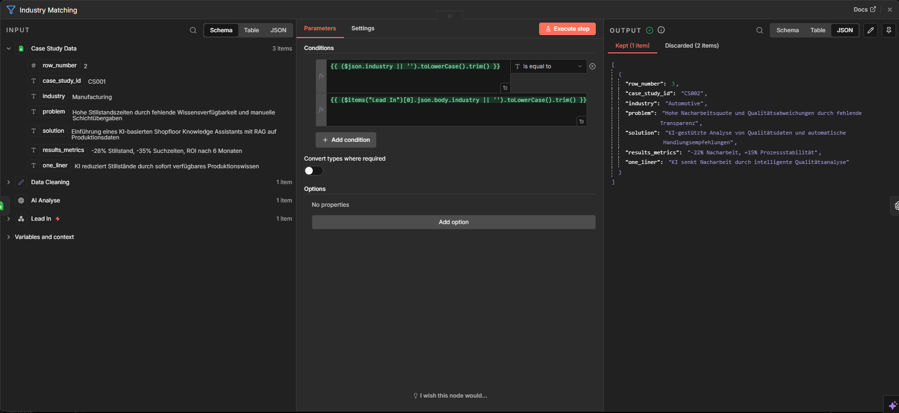

---

## 06) Personalized Mail (AI Draft)

Generates a personalized outreach email draft using:

- lead context (pains, urgency)
- the matched case study (proof + metrics)
- a clear call-to-action

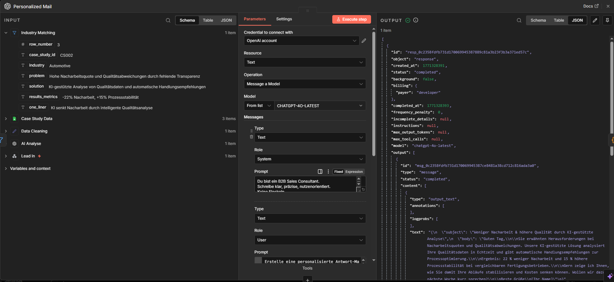

---

## 07) Lead Scoring (Prepare Mail Fields)

Cleans/parses the AI response and extracts `subject` + `body` reliably for downstream processing.

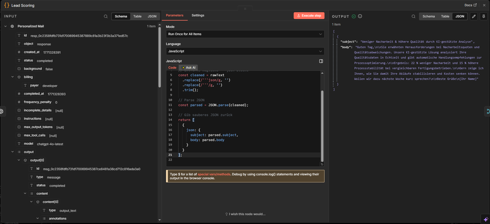

---

## 08) Merge (Combine Lead + Case Study + Mail)

Merges lead data + matched case study + generated mail draft into a single item (one unified record).

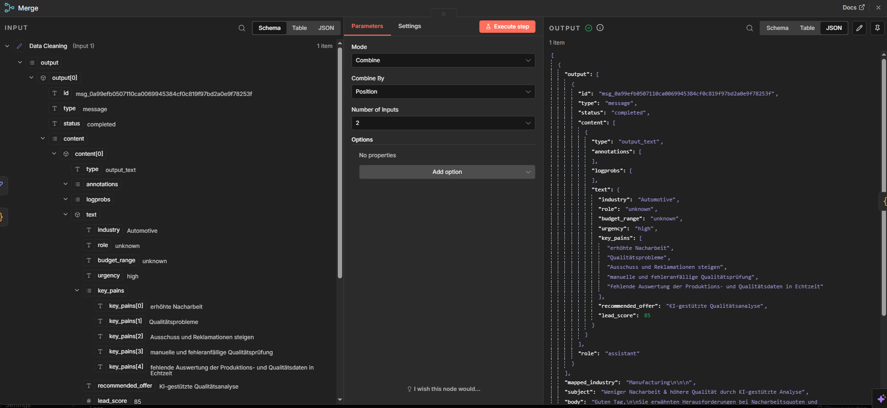

---

## 09) Lead Scoring 2 (Final Scoring + Status)

Runs final scoring logic and produces the final CRM-ready fields, including:

- timestamp
- source
- normalized industry
- lead_score
- key_pains
- recommended_offer
- case_study_id
- draft_subject + draft_reply
- status

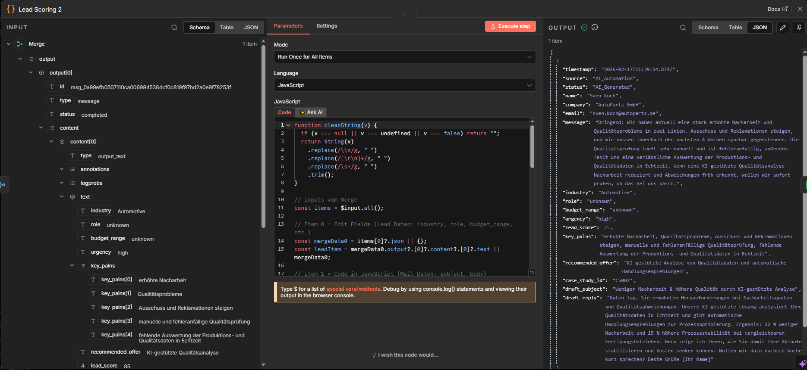

---

## 10) CRM / Sheet (Write to Google Sheets)

Appends the unified lead record into a Google Sheet (CRM-like pipeline board).

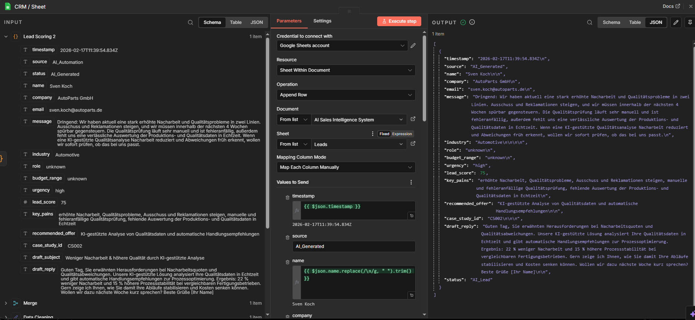

---

## 11) Execution Proof (n8n Run)

Successful end-to-end workflow execution in n8n (all steps green).

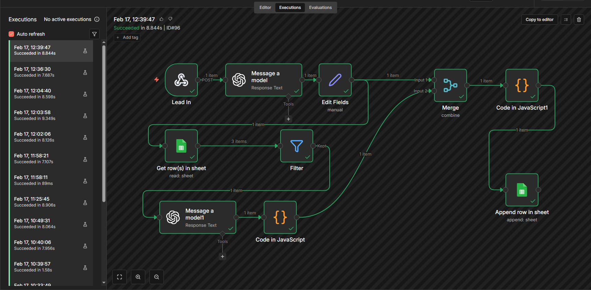

---

# ✅ Final Result – Google Sheet (CRM View)

Example of the final CRM dashboard entry containing:

- Timestamp, source, contact/company/email
- Lead message
- Industry + urgency + lead_score
- Key pains + recommended offer
- Case study mapping
- Draft email (subject + reply)
- Status

---

# 💼 Business Impact

- **Faster response times** for inbound leads (no manual triage)
- **Consistent qualification** (structured extraction + scoring)
- **Higher reply rates** via proof-based personalization (case study metrics)
- **Sales efficiency**: reps start with a ready-to-send draft + context

---

# 📈 Scalability Potential

This architecture can be extended to:

- HubSpot / Salesforce integration (create/update leads automatically)
- Multi-step sequences (follow-ups after X days if no reply)
- Lead routing (assign to reps based on industry/score)
- Enrichment (company size, tech stack, LinkedIn, domains)
- A/B testing of subject lines & CTAs
- Deal stage automation + forecasting dashboards

---

# 🛠 Technology Stack

- n8n (workflow orchestration)
- OpenAI API (LLM-based analysis + copy generation)
- Google Sheets (case study database + CRM dashboard)
- Webhook (real-time inbound lead ingestion)

---

## 🔥 What This Demonstrates

- AI workflow orchestration end-to-end
- Structured LLM output enforcement (JSON)
- Data normalization & matching logic
- Proof-based personalization (case study metrics)
- Lead scoring and CRM persistence
- Production-style automation design
